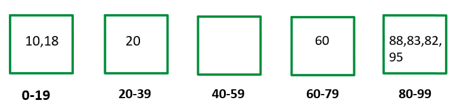
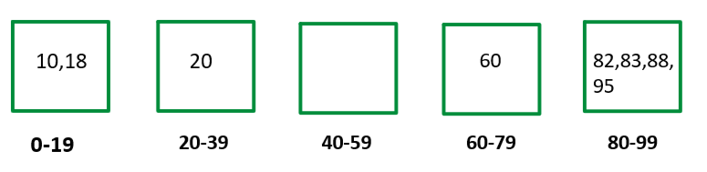

# Sorting

## Selection Sort

- Intitution : move the smallest element to left, sorts the array;  find the minimum element index then swap the first index
- Complexity : Time : O(N^2), Space : O(1)  

```java
class SelectionSort
{
	void selectionSort(int arr[])
	{
	    int n = arr.length;
	    for(int i=0;i<n-1;i++){
	        int minI = i;
	        for(int j=i;j<n;j++){
	            if(arr[j] < arr[minI]){
	                minI = j;
	            }
	        }
            swap(arr,i,minI);
	    }
	}
	void swap(int []arr,int i, int j){
	    int temp = arr[i];
	    arr[i] = arr[j];
	    arr[j] = temp;
	}
}
```

### Q.2 Bubble Sort 

* @Intitution : move the largest element to right, sorts the array;
* @Approach : compare two adjacent pairs and swap if left > right;
* @Complexity : Time : O(N^2), Space : O(1)  

```java
class BubbleSort {
    public static void bubbleSort(int arr[]) {
        for(int i=0;i<arr.length;i++){
            for(int j=1;j<arr.length;j++){
                if(arr[j-1] > arr[j]){
                    swap(j-1, j, arr);
                }
            }
        }
    }
    public static void swap(int i, int j, int arr[]){
        var x = arr[i];
        arr[i] = arr[j];
        arr[j] = x;
    }
}
```

## Bucket Sort
When a set of data is present within a range and uniformly distributed, we make buckets to store those elements. Later we sort those buckets and then join those sorted buckets. 

Example : 
nums = [20 88 10 83 18 82 60 95] 



Now we sort these elements in the bucket individually.



nums = [10 18 20 60 82 83 88 95]

```java
import java.io.*;
import java.lang.*;
import java.util.*;

class TUF {
  public static void main(String[] args) {
    int arr[] = {30, 40, 10, 80, 5, 12, 70};
    int n = arr.length;
    int k = 4;
    bucketSort(arr, n, k);

    for (int i = 0; i < n; i++)
      System.out.print(arr[i] + " ");

  }

  static void bucketSort(int arr[], int n, int k) {

    int maxElement = arr[0];
    for (int i = 1; i < n; i++)
      maxElement = Math.max(maxElement, arr[i]);
    maxElement++;

    // Building buckets
    ArrayList<ArrayList<Integer> > buckets = new ArrayList<>();
    
    for (int i = 0; i < n; i++) {
      ArrayList<Integer> temp=new ArrayList<>();
      buckets.add(temp);
      
    }
    // Filling buckets
    for (int i = 0; i < n; i++) {
      int bucketIndex = (arr[i] * k) / maxElement;
      buckets.get((int) bucketIndex).add(arr[i]);
    }
    // Sorting buckets
    for (int i = 0; i < k; i++) {
      Collections.sort(buckets.get(i));
    }

    // Merging buckets
    int index = 0;
    for (int i = 0; i < k; i++) {
      for (int j = 0; j < buckets.get(i).size(); j++) {
        arr[index++] = buckets.get(i).get(j);
      }
    }
  }
}
```

# Problems

## Q. [Sort Characters by frequency](https://leetcode.com/problems/sort-characters-by-frequency/description/)

Given a string s, sort it in decreasing order based on the frequency of the characters. The frequency of a character is the number of times it appears in the string.

Return the sorted string. If there are multiple answers, return any of them.

```
Example 1:

Input: s = "tree"
Output: "eert"
Explanation: 'e' appears twice while 'r' and 't' both appear once.
So 'e' must appear before both 'r' and 't'. Therefore "eetr" is also a valid answer.

Example 2:

Input: s = "cccaaa"
Output: "aaaccc"
Explanation: Both 'c' and 'a' appear three times, so both "cccaaa" and "aaaccc" are valid answers.
Note that "cacaca" is incorrect, as the same characters must be together.

Example 3:

Input: s = "Aabb"
Output: "bbAa"
Explanation: "bbaA" is also a valid answer, but "Aabb" is incorrect.
Note that 'A' and 'a' are treated as two different characters.
```
### Approach : Bucket Sort

```java
/**
 * Intituiton : 
 * Time : N
 * Space : N
*/
public class Solution {
    public String frequencySort(String s) {
        int n = s.length();
        Map<Character, Integer> freqMap = new HashMap<>();

        // Count frequency of each character
        for (char ch : s.toCharArray()) {
            freqMap.put(ch, freqMap.getOrDefault(ch, 0) + 1);
        }

        // Bucket where index = frequency, each bucket holds characters
        List<List<Character>> buckets = new ArrayList<>(n + 1);
        for (int i = 0; i <= n; i++) {
            buckets.add(new ArrayList<>());
        }

        // Place characters into buckets based on frequency
        for (Map.Entry<Character, Integer> entry : freqMap.entrySet()) {
            char ch = entry.getKey();
            int freq = entry.getValue();
            buckets.get(freq).add(ch);
        }

        // Build result from highest frequency to lowest
        StringBuilder result = new StringBuilder();
        for (int i = n; i >= 0; i--) {
            for (char ch : buckets.get(i)) {
                for (int j = 0; j < i; j++) {
                    result.append(ch);
                }
            }
        }

        return result.toString();
    }
}
```
