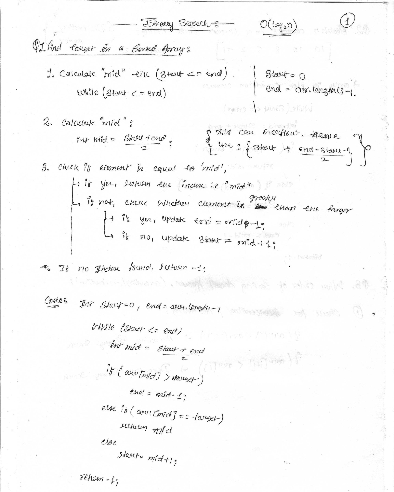
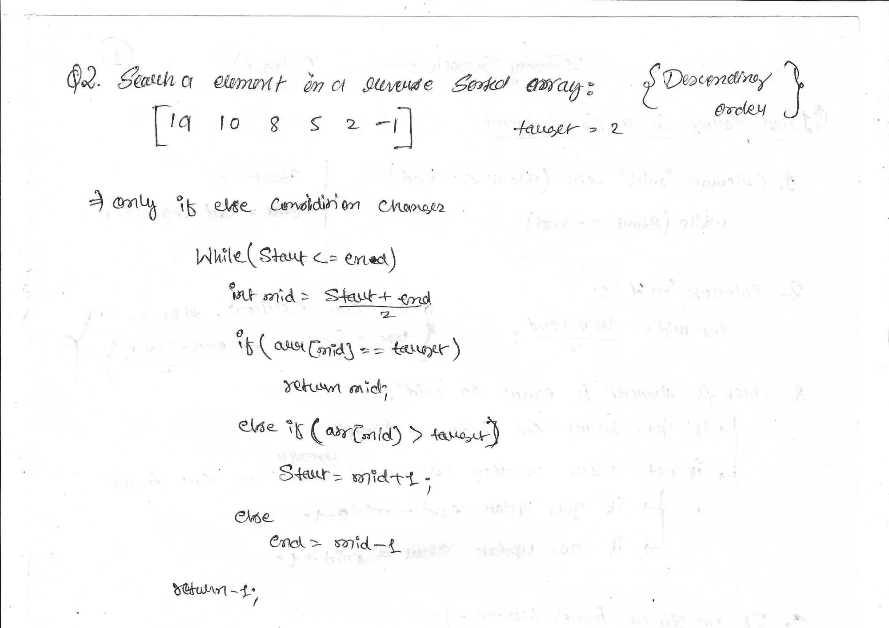
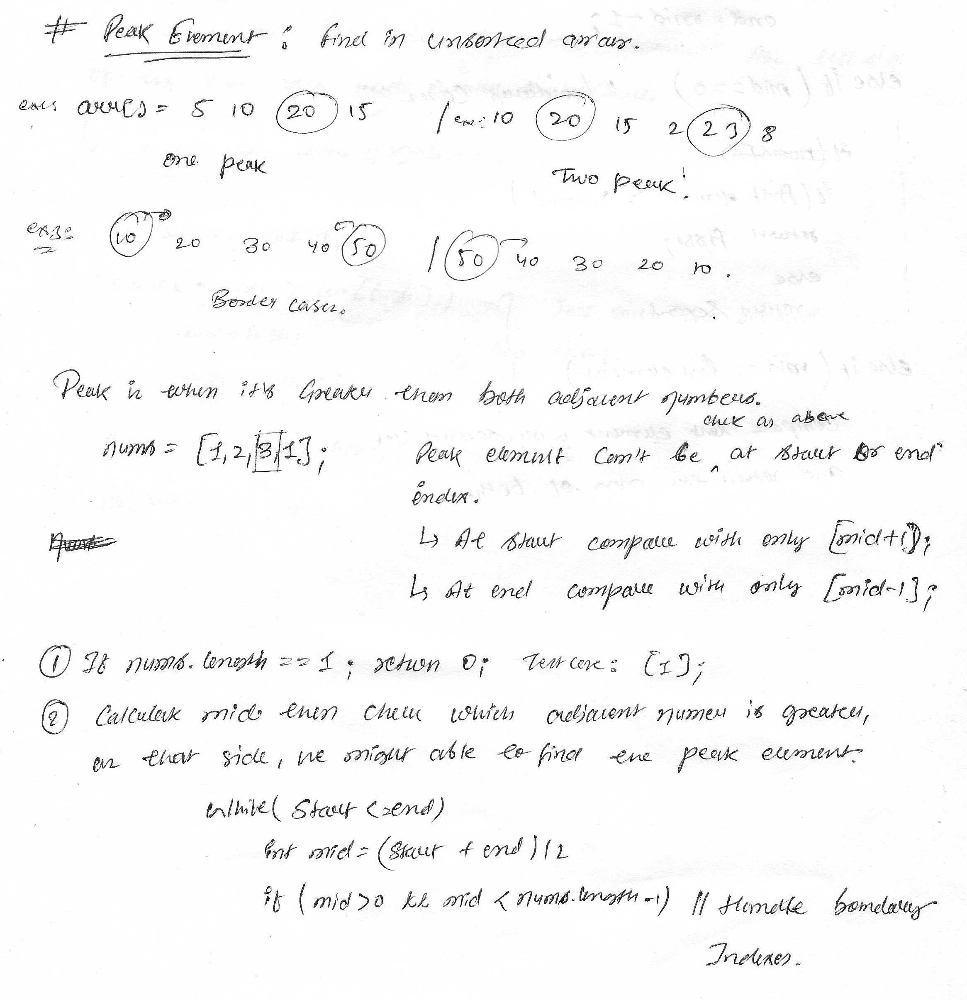
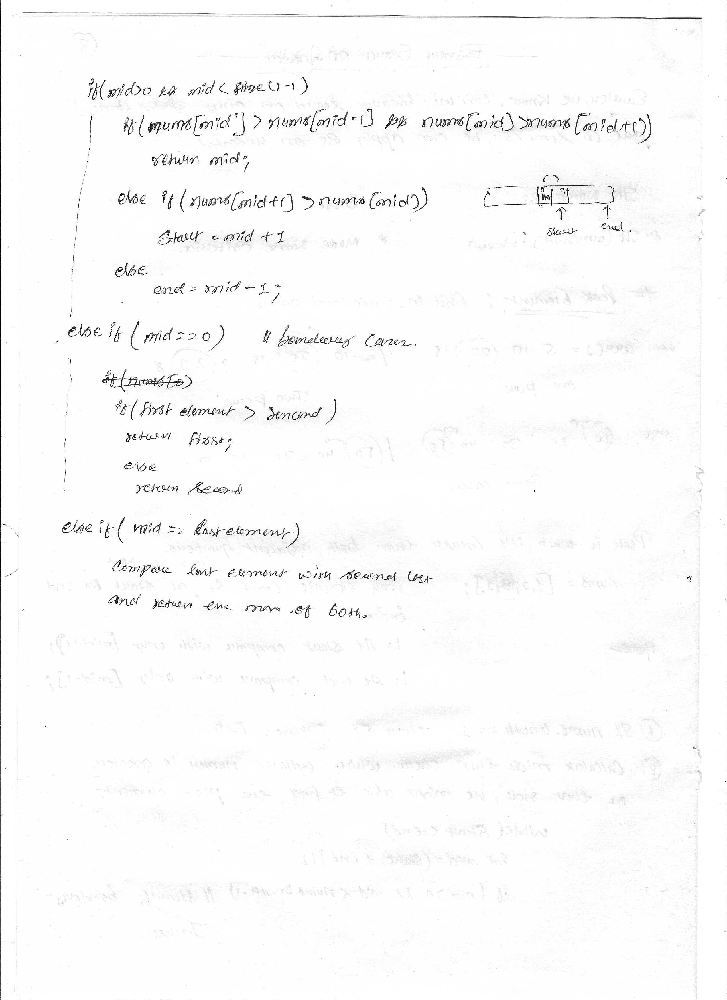
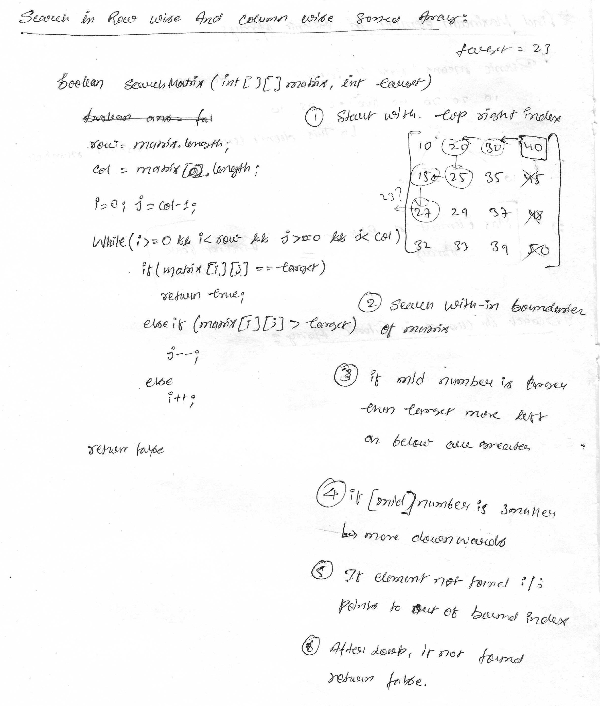

# Binary Search

### Q.1 [Find target in a sorted array](https://www.geeksforgeeks.org/problems/binary-search-1587115620/1)
Given a sorted array arr and an integer k, find the position(0-based indexing) at which k is present in the array using binary search.

Note: If multiple occurrences are there, please return the smallest index.

```java
Input: arr[] = [1, 2, 3, 4, 5], k = 4
Output: 3
Explanation: 4 appears at index 3.

Input: arr[] = [11, 22, 33, 44, 55], k = 445
Output: -1
Explanation: 445 is not present.

Input: arr[] = [1, 1, 1, 1, 2], k = 1
Output: 0
Explanation: 1 appears at index 0.
```



### Q.2 Find target in a reverse sorted array



### Q.3 
<!--  -->


# Binary Search on Answers
Earlier, we know binary search is applied only on sorted arrays, but in some cases this can be applied to unsorted arrays.

We use some break condition instead of (arr[mid] == target)

### Q.15 [Peak Element](https://leetcode.com/problems/find-peak-element/description/)

A peak element is an element that is strictly greater than its neighbors.

Given a 0-indexed integer array nums, find a peak element, and return its index. If the array contains multiple peaks, return the index to any of the peaks.

You may imagine that nums[-1] = nums[n] = -∞. In other words, an element is always considered to be strictly greater than a neighbor that is outside the array.

You must write an algorithm that runs in O(log n) time.

```java
Example 1:

Input: nums = [1,2,3,1]
Output: 2
Explanation: 3 is a peak element and your function should return the index number 2.

Example 2:

Input: nums = [1,2,1,3,5,6,4]
Output: 5
Explanation: Your function can return either index number 1 where the peak element is 2, or index number 5 where the peak element is 6.
```



### Q.16 Find Maximum Element in bitonic array

Given a bitonic array find the maximum value of the array.

```java
Input: 1 4 8 3 2
Output: 8
```

### Q.17 Find an element in Bitonic array

Given a bitonic sequence of n distinct elements, and an integer x, the task is to write a program to find given element x in the bitonic sequence in O(log n) time. 

```java
Input :  arr[] = {-3, 9, 18, 20, 17, 5, 1}, key = 20
Output : Found at index 3


Input :  arr[] = {5, 6, 7, 8, 9, 10, 3, 2, 1}, key = 30
Output : Not Found
```

### Q.18 [Search in a row wise and column wise sorted matrix](https://www.geeksforgeeks.org/problems/search-in-a-matrix17201720/1)

Given a matrix mat[][] and an integer x, the task is to check if x is present in mat[][] or not. Every row and column of the matrix is sorted in increasing order.

```java
Input: x = 62, mat[][] = [[3, 30, 38],
                          [20, 52, 54],
                          [35, 60, 69]]
Output: false
Explanation: 62 is not present in the matrix.


Input: x = 55, mat[][] = [[18, 21, 27],
                          [38, 55, 67]]
Output: true
Explanation: mat[1][1] is equal to 55.


Input: x = 35, mat[][] = [[3, 30, 38],
                          [20, 52, 54],
                          [35, 60, 69]]
Output: true
Explanation: mat[2][0] is equal to 35.
```



### Q.19 [Allocate Minimum Pages](https://www.geeksforgeeks.org/problems/allocate-minimum-number-of-pages0937/1)

You are given an array arr[] of integers, where each element arr[i] represents the number of pages in the ith book. You also have an integer k representing the number of students. The task is to allocate books to each student such that:

Each student receives atleast one book.
Each student is assigned a contiguous sequence of books.
No book is assigned to more than one student.
The objective is to minimize the maximum number of pages assigned to any student. In other words, out of all possible allocations, find the arrangement where the student who receives the most pages still has the smallest possible maximum.

Note: Return -1 if a valid assignment is not possible, and allotment should be in contiguous order (see the explanation for better understanding).


```java
Input: arr[] = [12, 34, 67, 90], k = 2
Output: 113

Explanation: Allocation can be done in following ways:
[12] and [34, 67, 90] Maximum Pages = 191
[12, 34] and [67, 90] Maximum Pages = 157
[12, 34, 67] and [90] Maximum Pages = 113.
Therefore, the minimum of these cases is 113, which is selected as the output.

Input: arr[] = [15, 17, 20], k = 5
Output: -1
Explanation: Allocation can not be done.

Input: arr[] = [22, 23, 67], k = 1
Output: 112
```

