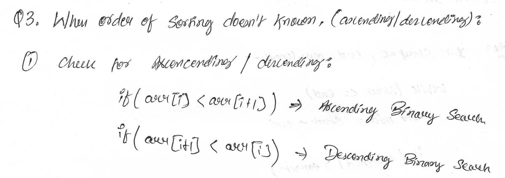
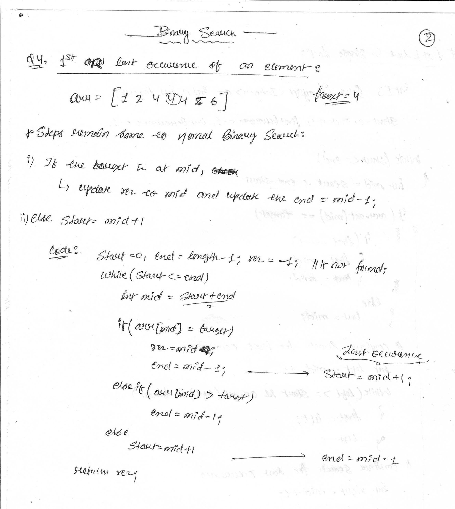
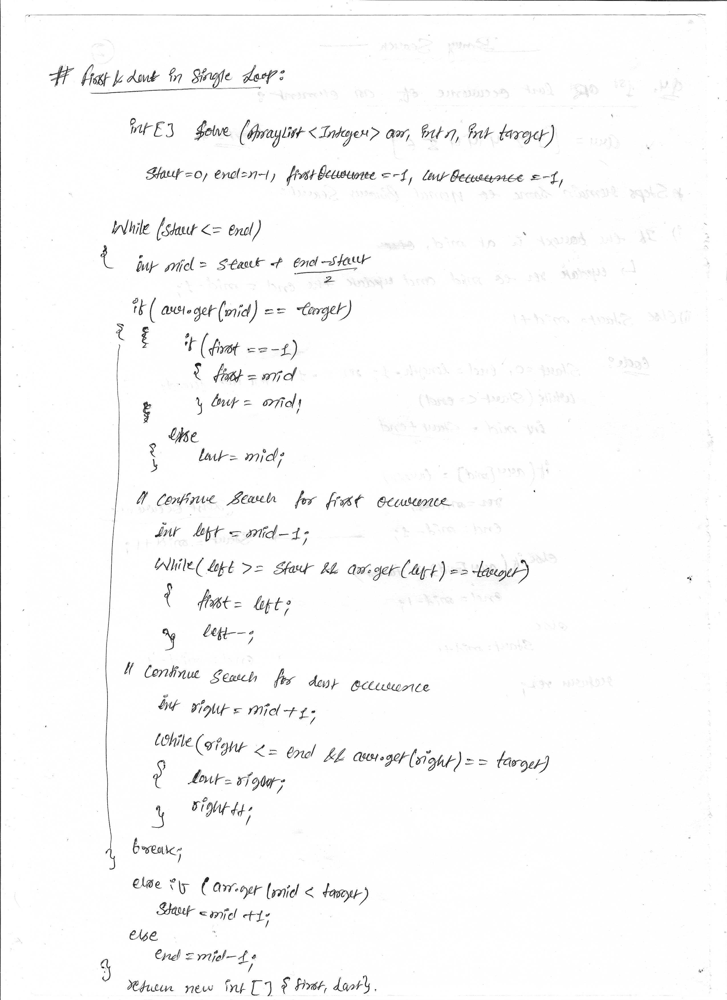
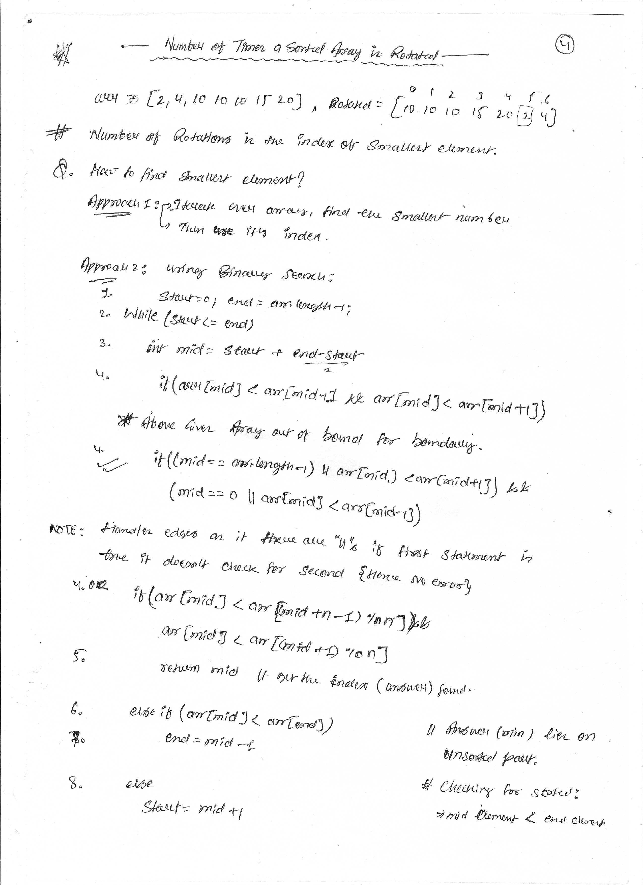
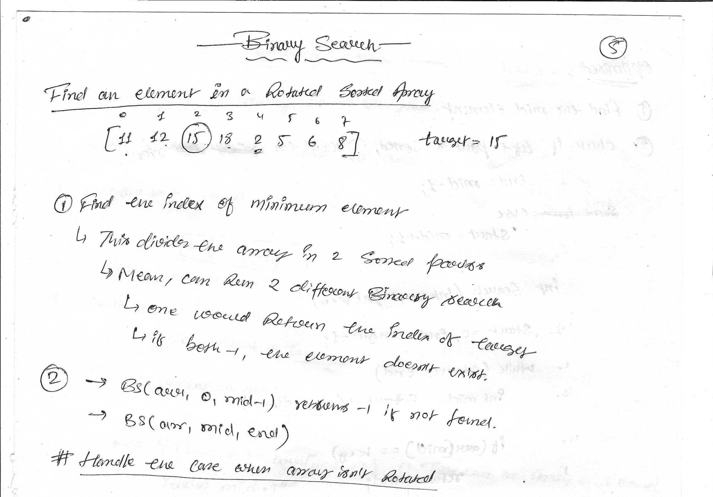
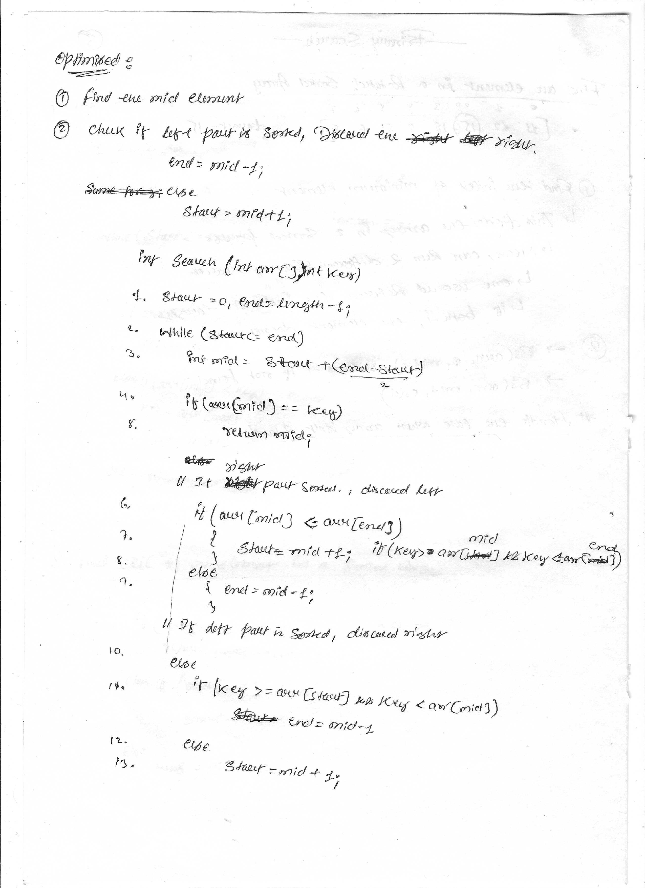
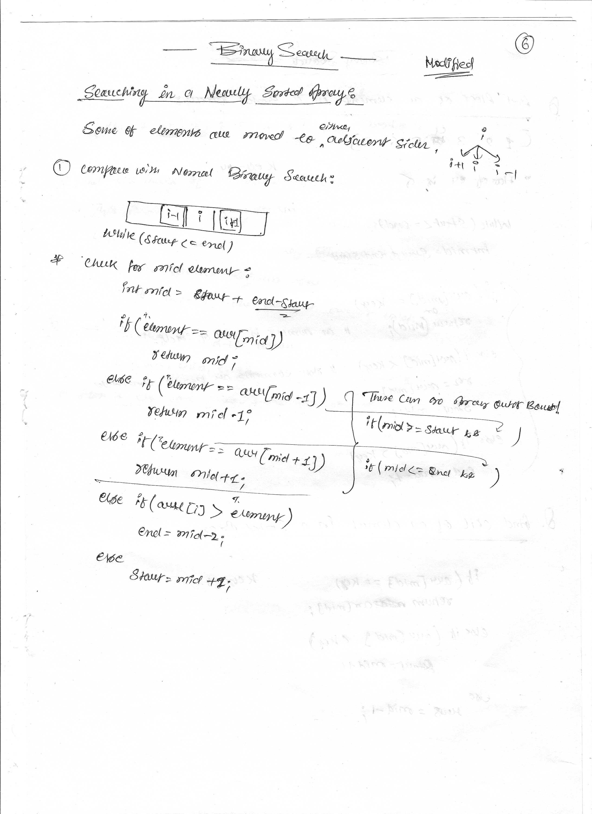
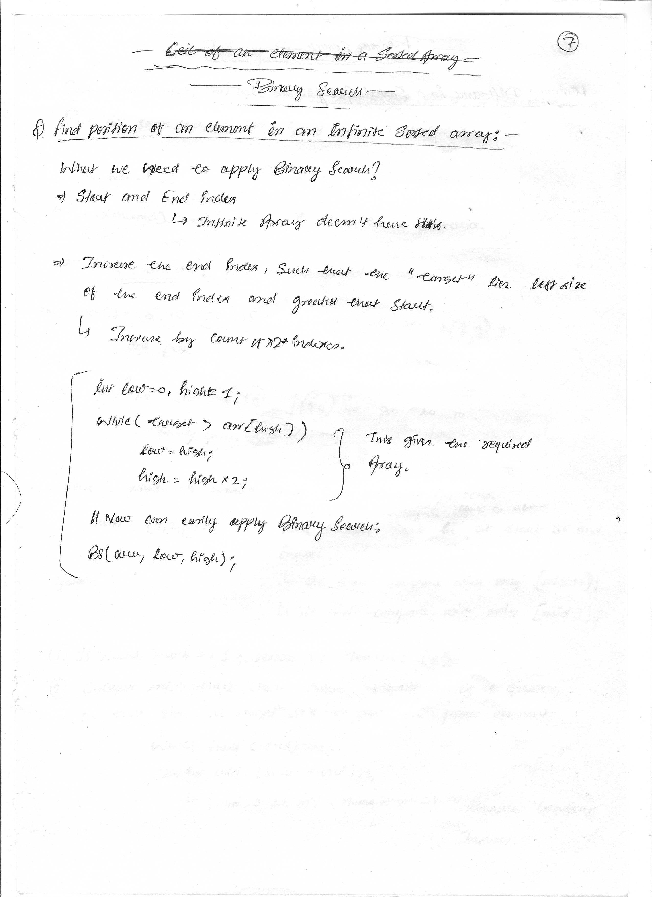
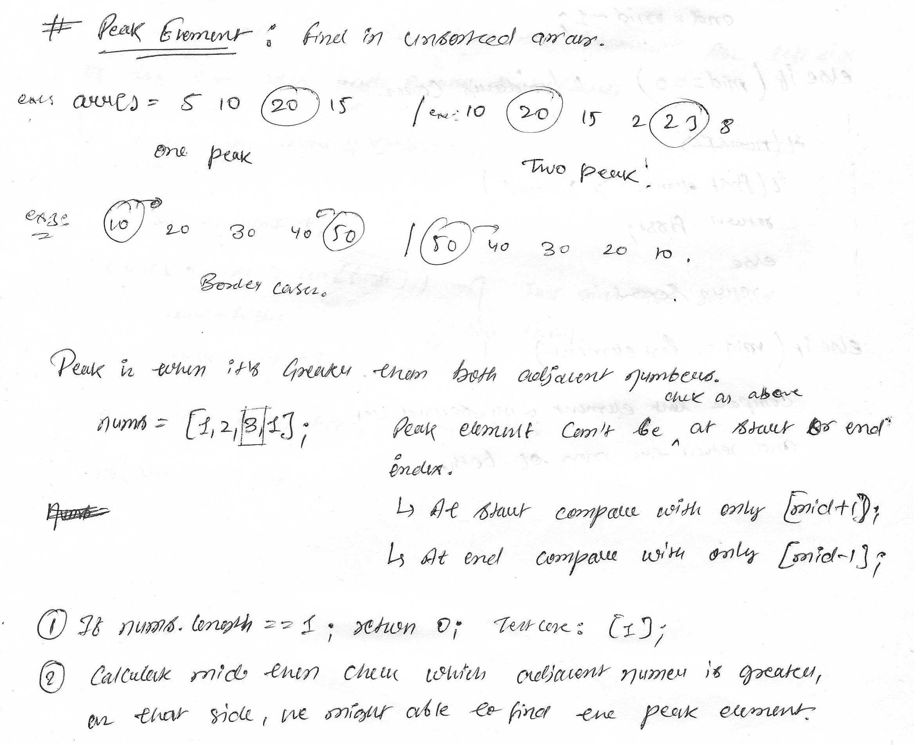

# Binary Search

### Q.1 [Find target in a sorted array](https://www.geeksforgeeks.org/problems/binary-search-1587115620/1)
Given a sorted array arr and an integer k, find the position(0-based indexing) at which k is present in the array using binary search.

Note: If multiple occurrences are there, please return the smallest index.

```java
Input: arr[] = [1, 2, 3, 4, 5], k = 4
Output: 3
Explanation: 4 appears at index 3.

Input: arr[] = [11, 22, 33, 44, 55], k = 445
Output: -1
Explanation: 445 is not present.

Input: arr[] = [1, 1, 1, 1, 2], k = 1
Output: 0
Explanation: 1 appears at index 0.
```


```java
function search(nums: number[], target: number): number {
    let n = nums.length -1;
    let l = 0;
    let r=n;
    while(l<=r){
        let mid = Math.floor(l + ((r-l)/2));
        if(nums[mid] === target) return mid;
        else if(nums[mid] < target){
            l = mid+1;
        }
        else if(nums[mid]>target){
            r=mid-1;
        }
    }
    return -1;
};

/**
 * return first occurence
*/

class Solution {
    public int binarysearch(int[] nums, int target) {
        int l = 0;
        int r = nums.length - 1;
        int idx = -1;

        while (l <= r) {
            int mid = l + (r - l) / 2;
            if (nums[mid] == target) {
                idx = mid; //this changes
                r = mid-1;
              
            } else if (nums[mid] < target) {
                l = mid + 1;
            } else {
                r = mid - 1;
            }
        }

        return idx;
    }
}
```

### Q.2 Find target in a reverse sorted array


### Q.3 Order Not Known

Given a sorted array of numbers, find if a given number ‘key’ is present in the array. Though we know that the array is sorted, we don’t know if it’s sorted in ascending or descending order.



```java
class Solution {
public:
    int search(vector<int>& nums, int target) {
      int start= 0;
      int end= nums.size()-1;
      if (nums[0]>nums[1]){ // desending
        while (start <= end)
        {
            int mid = start + (end-start)/2;
            if (target==nums[mid])
                return mid;
            else if (target<nums[mid])
                start= mid+1; // little variation
            else 
                end= mid-1;
        }
        return -1;
      }
      if (nums[0]<nums[1]){ // ascending 
         while (start <= end)
        {
            int mid = start + (end-start)/2;
            if (target==nums[mid])
                return mid;
            else if (target<nums[mid])
                end= mid-1;
            else 
                start= mid+1;
        }
        return -1;
      }

    }
};
```

### Q.4 [Find first and last positions of an element](https://www.geeksforgeeks.org/find-first-and-last-positions-of-an-element-in-a-sorted-array/)

Given a sorted array arr[] with possibly some duplicates, the task is to find the first and last occurrences of an element x in the given array.

Note: If the number x is not found in the array then return both the indices as -1.

```java

Input : arr[] = [1, 3, 5, 5, 5, 5, 67, 123, 125], x = 5
Output : 2 5
Explanation: First occurrence of 5 is at index 2 and last occurrence of 5 is at index 5


Input : arr[] = [1, 3, 5, 5, 5, 5, 7, 123, 125 ], x = 7
Output : 6 6
Explanation: First and last occurrence of 7 is at index 6


Input: arr[] = [1, 2, 3], x = 4
Output: -1 -1
Explanation: No occurrence of 4 in the array, so, output is [-1, -1]
```



### Q.5 [Number of occurrence](https://www.geeksforgeeks.org/problems/number-of-occurrence2259/1)
Given a sorted array, arr[] and a number target, you need to find the number of occurrences of target in arr[]. 

```java
Input: arr[] = [1, 1, 2, 2, 2, 2, 3], target = 2
Output: 4
Explanation: target = 2 occurs 4 times in the given array so the output is 4.

Input: arr[] = [1, 1, 2, 2, 2, 2, 3], target = 4
Output: 0
Explanation: target = 4 is not present in the given array so the output is 0.

Input: arr[] = [8, 9, 10, 12, 12, 12], target = 12
Output: 3
Explanation: target = 12 occurs 3 times in the given array so the output is 3
```


### Q.6 [Find the Rotation Count in Rotated Sorted array](https://www.geeksforgeeks.org/problems/rotation4723/1)
Given an increasing sorted rotated array arr of distinct integers. The array is right-rotated k times. Find the value of k.
Let's suppose we have an array arr = [2, 4, 6, 9], so if we rotate it by 2 times so that it will look like this:
After 1st Rotation : [9, 2, 4, 6]
After 2nd Rotation : [6, 9, 2, 4]

```java
Input: arr = [5, 1, 2, 3, 4]
Output: 1
Explanation: The given array is 5 1 2 3 4. The original sorted array is 1 2 3 4 5. We can see that the array was rotated 1 times to the right.
Input: arr = [1, 2, 3, 4, 5]
Output: 0
Explanation: The given array is not rotated.
```


### Q.7 [Search in Rotated Sorted Array](https://leetcode.com/problems/search-in-rotated-sorted-array/description/)
There is an integer array nums sorted in ascending order (with distinct values).

Prior to being passed to your function, nums is possibly rotated at an unknown pivot index k (1 <= k < nums.length) such that the resulting array is [nums[k], nums[k+1], ..., nums[n-1], nums[0], nums[1], ..., nums[k-1]] (0-indexed). For example, [0,1,2,4,5,6,7] might be rotated at pivot index 3 and become [4,5,6,7,0,1,2].

Given the array nums after the possible rotation and an integer target, return the index of target if it is in nums, or -1 if it is not in nums.

You must write an algorithm with O(log n) runtime complexity.
 
```java
Input: nums = [4,5,6,7,0,1,2], target = 0
Output: 4

Input: nums = [4,5,6,7,0,1,2], target = 3
Output: -1

Input: nums = [1], target = 0
Output: -1
```



### Q.8 [Search in an almost Sorted Array](https://www.geeksforgeeks.org/problems/search-in-an-almost-sorted-array/1)
Given an array which is sorted, but after sorting some elements are moved to either of the adjacent positions, i.e., arr[i] may be present at arr[i+1] or arr[i-1]. Write an efficient function to search an element in this array. Basically the element arr[i] can only be swapped with either arr[i+1] or arr[i-1].

For example consider the array {2, 3, 10, 4, 40}, 4 is moved to next position and 10 is moved to previous position.

```java
Example :
Input: arr[] =  {10, 3, 40, 20, 50, 80, 70}, key = 40
Output: 2 
Output is index of 40 in given array
```


### Q.9 [Floor in a Sorted Array](https://www.geeksforgeeks.org/problems/floor-in-a-sorted-array-1587115620/1)
Given a sorted array and a value x, the floor of x is the largest element in array smaller than or equal to x. Write efficient functions to find floor of x.

```java
Input : arr[] = {1, 2, 8, 10, 10, 12, 19}, x = 5
Output : 2
2 is the largest element in arr[] smaller than 5.
```


### Q.10 [Ceil in a Sorted Array](https://www.geeksforgeeks.org/problems/ceil-in-a-sorted-array/1)
Given a sorted array arr[] and an integer x, find the index (0-based) of the smallest element in arr[] that is greater than or equal to x. This element is called the ceil of x. If such an element does not exist, return -1.

Note: In case of multiple occurrences of ceil of x, return the index of the first occurrence.

```java
Input: arr[] = [1, 2, 8, 10, 11, 12, 19], x = 5
Output: 2
Explanation: Smallest number greater than 5 is 8, whose index is 2.

Input: arr[] = [1, 2, 8, 10, 11, 12, 19], x = 20
Output: -1
Explanation: No element greater than 20 is found. So output is -1.

Input: arr[] = [1, 1, 2, 8, 10, 11, 12, 19], x = 0
Output: 0
Explanation: Smallest number greater than 0 is 1, whose indices are 0 and 1. The index of the first occurrence is 0.
```


### Q.11 [Find Smallest Letter Greater Than Target](https://leetcode.com/problems/find-smallest-letter-greater-than-target/description/)
Given an array of letters sorted in ascending order, find the smallest letter in the the array which is greater than a given key letter.

```java
Input: letters = ["c","f","j"], target = "a"
Output: "c"
Explanation: The smallest character that is lexicographically greater than 'a' in letters is 'c'.

Input: letters = ["c","f","j"], target = "c"
Output: "f"
Explanation: The smallest character that is lexicographically greater than 'c' in letters is 'f'.

Input: letters = ["x","x","y","y"], target = "z"
Output: "x"
Explanation: There are no characters in letters that is lexicographically greater than 'z' so we return letters[0].
```


### Q.12 [Find position of an element in an Infinite Sorted Array](https://www.geeksforgeeks.org/find-position-element-sorted-array-infinite-numbers/)
Given a sorted array arr[] of infinite numbers. The task is to search for an element k in the array.

```java
Input: arr[] = [3, 5, 7, 9, 10, 90, 100, 130, 140, 160, 170], k = 10
Output: 4
Explanation: 10 is at index 4 in array.


Input: arr[] = [2, 5, 7, 9], k = 3
Output: -1
Explanation: 3 is not present in array.
```

#### Intitution: 
Since array is sorted, the first thing clicks into mind is binary search, but the problem here is that we don’t know size of array.
If the array is infinite, that means we don’t have proper bounds to apply binary search. So in order to find position of key, first we find bounds and then apply binary search algorithm.

Let low be pointing to 1st element and high pointing to 2nd element of array, Now compare key with high index element,
-if it is greater than high index element then copy high index in low index and double the high index.
-if it is smaller, then apply binary search on high and low indices found.



### Q.13 [Index of First 1 in a Binary Sorted Infinite Array](https://www.geeksforgeeks.org/find-index-first-1-infinite-sorted-array-0s-1s/)

Given an infinite sorted array consisting 0s and 1s. The problem is to find the index of first ‘1’ in that array. As the array is infinite, therefore it is guaranteed that number ‘1’ will be present in the array.

```java
Input : arr[] = {0, 0, 1, 1, 1, 1} 
Output : 2

Input : arr[] = {1, 1, 1, 1,, 1, 1}
Output : 0
```


### Q.14 [Minimum Difference Element in a Sorted Array](https://www.geeksforgeeks.org/find-minimum-difference-pair/)

Given an unsorted array, find the minimum difference between any pair in the given array.

```java
Input: {1, 5, 3, 19, 18, 25}
Output: 1
Explanation: Minimum difference is between 18 and 19

Input: {30, 5, 20, 9}
Output: 4
Explanation: Minimum difference is between 5 and 9

Input: {1, 19, -4, 31, 38, 25, 100}
Output: 5
Explanation: Minimum difference is between 1 and -4
```

# Binary Search on Answers
Earlier, we know binary search is applied only on sorted arrays, but in some cases this can be applied to unsorted arrays.

We use some break condition instead of (arr[mid] == target)

### Q.15 [Peak Element](https://leetcode.com/problems/find-peak-element/description/)

A peak element is an element that is strictly greater than its neighbors.

Given a 0-indexed integer array nums, find a peak element, and return its index. If the array contains multiple peaks, return the index to any of the peaks.

You may imagine that nums[-1] = nums[n] = -∞. In other words, an element is always considered to be strictly greater than a neighbor that is outside the array.

You must write an algorithm that runs in O(log n) time.

```java
Example 1:

Input: nums = [1,2,3,1]
Output: 2
Explanation: 3 is a peak element and your function should return the index number 2.

Example 2:

Input: nums = [1,2,1,3,5,6,4]
Output: 5
Explanation: Your function can return either index number 1 where the peak element is 2, or index number 5 where the peak element is 6.
```


```java
class Solution {
    public int findPeakElement(int[] nums) {
        int start = 0;
        int end = nums.length-1;
        if (end == 0) return 0;
        while(start<=end){
            int mid = start + (end-start)/2;
            if(mid>0 && mid<nums.length-1){//handle boundary indexes
                if(nums[mid] > nums[mid-1] && nums[mid] > nums[mid+1]){
                    return mid;
                }
                else if(nums[mid+1]>nums[mid]){
                    start = mid+1;
                }
                else 
                    end = mid-1;
            }
            //boundary cases
            else if(mid ==0){
                if(nums[0] > nums[1])
                return 0;
                else 
                return 1;
            }
            else if(mid == nums.length-1){
                if(nums[nums.length-1] > nums[nums.length-2])
                return nums.length-1;
                else 
                return nums.length-2;
            }

        }
            return -1;
    }
}
```

### Q.16 Find Maximum Element in bitonic array

Given a bitonic array find the maximum value of the array.

```java
Input: 1 4 8 3 2
Output: 8
```

### Q.17 Find an element in Bitonic array

Given a bitonic sequence of n distinct elements, and an integer x, the task is to write a program to find given element x in the bitonic sequence in O(log n) time. 

```java
Input :  arr[] = {-3, 9, 18, 20, 17, 5, 1}, key = 20
Output : Found at index 3


Input :  arr[] = {5, 6, 7, 8, 9, 10, 3, 2, 1}, key = 30
Output : Not Found
```

### Q.18 [Search in a row wise and column wise sorted matrix](https://leetcode.com/problems/search-a-2d-matrix/description/)

Given a matrix mat[][] and an integer x, the task is to check if x is present in mat[][] or not. Every row and column of the matrix is sorted in increasing order.

```java
Input: x = 62, mat[][] = [[3, 30, 38],
                          [20, 52, 54],
                          [35, 60, 69]]
Output: false
Explanation: 62 is not present in the matrix.


Input: x = 55, mat[][] = [[18, 21, 27],
                          [38, 55, 67]]
Output: true
Explanation: mat[1][1] is equal to 55.


Input: x = 35, mat[][] = [[3, 30, 38],
                          [20, 52, 54],
                          [35, 60, 69]]
Output: true
Explanation: mat[2][0] is equal to 35.
```


```java
class Solution {

    public boolean searchMatrix(int[][] matrix, int target) {
        boolean ans = false;
        int row = matrix.length;
        int col = matrix[0].length;
        //i= row/ j=col
        int i=0,j=col-1; 
        while(i>=0 && i<row && j>=0 && j<col){
            if(matrix[i][j] == target)
            return true;
            else if (matrix[i][j] > target)
                j--;
            else
                i++;
        }
        return false;

    }
}
```

### Q.19 [Allocate Minimum Pages](https://www.geeksforgeeks.org/problems/allocate-minimum-number-of-pages0937/1)

You are given an array arr[] of integers, where each element arr[i] represents the number of pages in the ith book. You also have an integer k representing the number of students. The task is to allocate books to each student such that:

Each student receives atleast one book.
Each student is assigned a contiguous sequence of books.
No book is assigned to more than one student.
The objective is to minimize the maximum number of pages assigned to any student. In other words, out of all possible allocations, find the arrangement where the student who receives the most pages still has the smallest possible maximum.

Note: Return -1 if a valid assignment is not possible, and allotment should be in contiguous order (see the explanation for better understanding).


```java
Input: arr[] = [12, 34, 67, 90], k = 2
Output: 113

Explanation: Allocation can be done in following ways:
[12] and [34, 67, 90] Maximum Pages = 191
[12, 34] and [67, 90] Maximum Pages = 157
[12, 34, 67] and [90] Maximum Pages = 113.
Therefore, the minimum of these cases is 113, which is selected as the output.

Input: arr[] = [15, 17, 20], k = 5
Output: -1
Explanation: Allocation can not be done.

Input: arr[] = [22, 23, 67], k = 1
Output: 112
```


