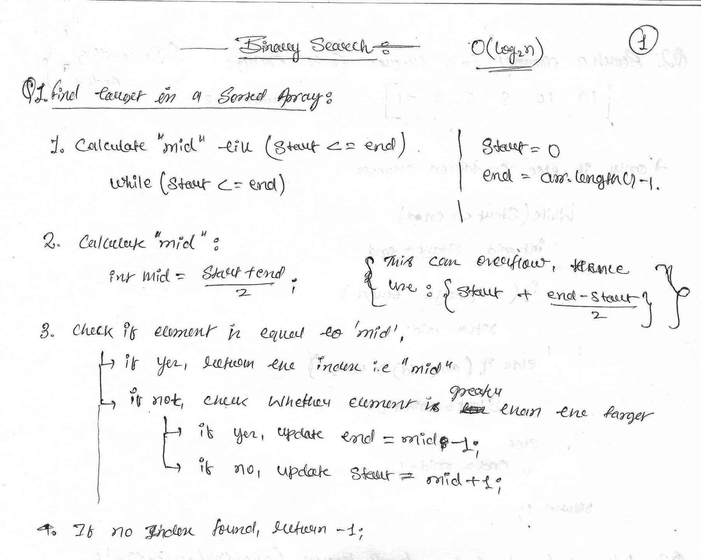

# Q.1 [Find target in a sorted array](https://www.geeksforgeeks.org/problems/binary-search-1587115620/1)
Given a sorted array arr and an integer k, find the position(0-based indexing) at which k is present in the array using binary search.

Note: If multiple occurrences are there, please return the smallest index.

```java
Input: arr[] = [1, 2, 3, 4, 5], k = 4
Output: 3
Explanation: 4 appears at index 3.

Input: arr[] = [11, 22, 33, 44, 55], k = 445
Output: -1
Explanation: 445 is not present.

Input: arr[] = [1, 1, 1, 1, 2], k = 1
Output: 0
Explanation: 1 appears at index 0.
```



```java
function search(nums: number[], target: number): number {
    let n = nums.length -1;
    let l = 0;
    let r=n;
    while(l<=r){
        let mid = Math.floor(l + ((r-l)/2));
        if(nums[mid] === target) return mid;
        else if(nums[mid] < target){
            l = mid+1;
        }
        else if(nums[mid]>target){
            r=mid-1;
        }
    }
    return -1;
};

/**
 * return first occurence
*/

class Solution {
    public int binarysearch(int[] nums, int target) {
        int l = 0;
        int r = nums.length - 1;
        int idx = -1;

        while (l <= r) {
            int mid = l + (r - l) / 2;
            if (nums[mid] == target) {
                idx = mid; //this changes
                r = mid-1;
              
            } else if (nums[mid] < target) {
                l = mid + 1;
            } else {
                r = mid - 1;
            }
        }

        return idx;
    }
}
```
