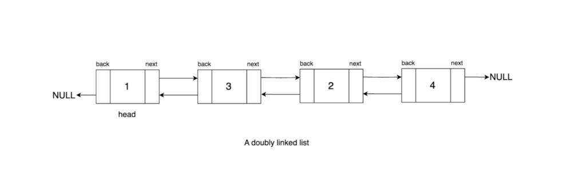

# Pseudo-Code

```java
Function constructDLL(arr):
    Create a new node 'head' with value arr[0]
    Set 'currNode' = head
    Set 'prevNode' = head

    For i from 1 to length of arr - 1:
        Create a new node 'nextNode' with value arr[i]
        Set currNode.next = nextNode
        Set currNode = currNode.next
        Set currNode.prev = prevNode
        Set prevNode.next = nextNode
        Set prevNode = prevNode.next

    Return head


```