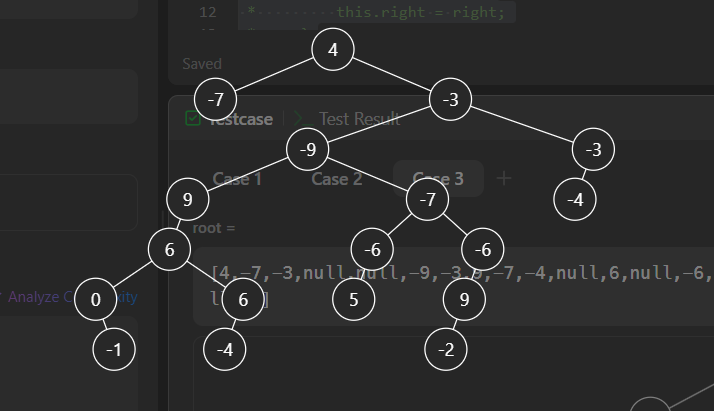

# [Diameter of  Binary Tree](https://leetcode.com/problems/diameter-of-binary-tree/description/)

Given the root of a binary tree, return the length of the diameter of the tree.

The diameter of a binary tree is the length of the longest path between any two nodes in a tree. This path may or may not pass through the root.

The length of a path between two nodes is represented by the number of edges between them.

### Example 1:

```
Input: root = [1,2,3,4,5]
Output: 3
Explanation: 3 is the length of the path [4,2,1,3] or [5,2,1,3].
```
```java
/**
 * Failed Test Case : Maximum Length Doesn't have to be through Root Node;
 * [4,-7,-3,null,null,-9,-3,9,-7,-4,null,6,null,-6,-6,null,null,0,6,5,null,9,null,null,-1,-4,null,null,null,-2]
 * Expected : 8
 * Output : 7
 * 
 */
class Solution {
    public int diameterOfBinaryTree(TreeNode root) {
        return dfs(root.left) + dfs(root.right);
    }
    public int dfs(TreeNode curr){
        if(curr == null){
            return 0;
        }
        int l = dfs(curr.left);
        int r = dfs(curr.right);
        return Math.max(l,r)+1;
    }
}
```


### Accepted:

```java
class Solution {
    int max = -1;
    public int diameterOfBinaryTree(TreeNode root) {
        dfs(root);
        return max;
    }
    public int dfs(TreeNode curr){
        if(curr == null){
            return 0;
        }
        int l = dfs(curr.left);
        int r = dfs(curr.right);
        max = Math.max(max, l+r);
        return Math.max(l,r)+1;
    }
}
```