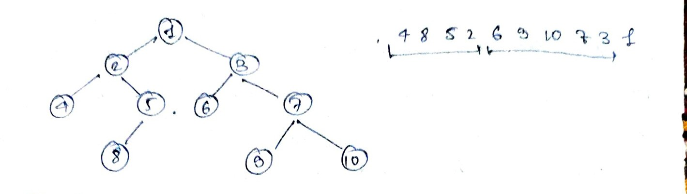

# [PostOrder](https://leetcode.com/problems/binary-tree-postorder-traversal/description/) - Left Right Root

Given the root of a binary tree, return the postorder traversal of its nodes' values.


### Example 2:

```
Input: root = [1,2,3,4,5,null,8,null,null,6,7,9]

Output: [4,6,7,5,2,9,8,3,1]
```
```java
/**
 * Definition for a binary tree node.
 * public class TreeNode {
 *     int val;
 *     TreeNode left;
 *     TreeNode right;
 *     TreeNode() {}
 *     TreeNode(int val) { this.val = val; }
 *     TreeNode(int val, TreeNode left, TreeNode right) {
 *         this.val = val;
 *         this.left = left;
 *         this.right = right;
 *     }
 * }
 */
class Solution {
    public List<Integer> postorderTraversal(TreeNode root) {
        List<Integer> output = new ArrayList<Integer>();
        postordeHelper(root, output);
        return output;
    }
    public List<Integer> postordeHelper(TreeNode node, List<Integer> output){
        if(node==null)
        return null;
        postordeHelper(node.left, output);
        postordeHelper(node.right, output);
        output.add(node.val);
        return output;
    }
}
```
```java
class Solution {
    public List<Integer> postorderTraversal(TreeNode root) {
        List<Integer> postOrder = new ArrayList<>();
        if(root == null) return postOrder;
        // Two stacks: 
        // stone - used for processing nodes
        // sttwo - used to reverse the order to get postorder
        Stack<TreeNode> stone = new Stack<>();
        Stack<TreeNode> sttwo = new Stack<>();
        TreeNode curr = root;
        // Start with pushing root into the first stack
        stone.push(curr);

         // Traverse the tree
        while(!stone.isEmpty()){
            curr = stone.pop();
            sttwo.push(curr);
            if(curr.left!=null){
                stone.push(curr.left);
            }
            if(curr.right != null){
                sttwo.push(curr.right);
            }
        }
        // Now, sttwo contains nodes in reverse postorder (root-right-left)
        // Pop them to get the correct postorder (left-right-root)
        while(!sttwo.isEmpty()){
            postOrder.add(sttwo.pop().val);
        }
        return postOrder;
    }
}
```